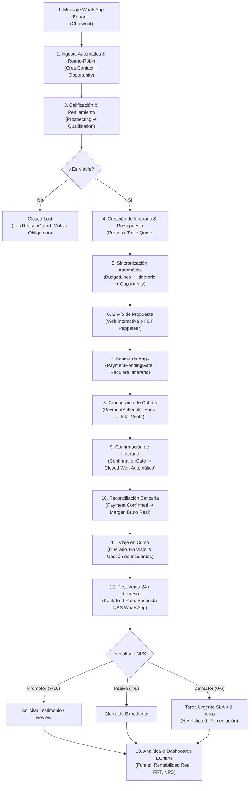

# Manual de Operaciones y Flujo de Trabajo del Asesor de Viajes
## SaaS CRM para Agencias de Viajes Reales (B2C & B2B)

Este manual documenta el **flujo operativo de inicio a fin (End-to-End)** que sigue un asesor de viajes dentro del CRM, detallando cada fase del viaje del cliente, las compuertas de seguridad (*guards*), las reglas contables de liquidación y todas las casuísticas excepcionales contempladas a lo largo de la plataforma.

---

## 1. Mapa General del Customer & Agent Journey

---

## 2. Guía Operativa Paso a Paso y Casuísticas

### FASE 1: Ingesta Omnicanal y Asignación Automática (Speed-to-Lead)
* **Punto de Partida:** Un potencial viajero escribe al WhatsApp oficial de la agencia solicitando información o cotización de un destino.
* **Comportamiento del Sistema:**
  1. Chatwoot recibe el mensaje y dispara el webhook autenticado mediante HMAC SHA-256 (`chatwootWebhookSecret`).
  2. El sistema busca el número telefónico en formato internacional E.164 (ejemplo: `+51987654321`).
  3. **Casuística de Cliente Existente:** Si el número ya existe, **no se duplica el contacto**; se vincula al expediente en curso o actualiza la conversación activa.
  4. **Casuística de Cliente Nuevo:** Se crea el registro `Contact`. Si el mensaje no trae nombre, aplica la *Ley de Postel* asignando *"Viajero WhatsApp"* como fallback seguro sin romper la operación.
  5. Se crea automáticamente una `Opportunity` en etapa `Prospecting` con origen `WhatsApp`.
  6. **Distribución Equitativa (Round-Robin):** El sistema asigna el lead de forma determinística al siguiente asesor activo en rotación.
* **Instrucción para el Asesor:**
  - Abrir la notificación en el CRM o responder directamente desde el inbox de Chatwoot.
  - **Meta de Desempeño:** Responder en menos de 15 minutos en horario comercial (L-V 09:00 - 18:00) para mantener la mediana de FRT (First Response Time) en niveles óptimos.

---

### FASE 2: Calificación y Perfilamiento (`Qualification`)
* **Acción del Asesor:** Entrevistar al viajero para determinar:
  - Destino deseado y fechas tentativas.
  - Número de pasajeros adultos, niños y seniors.
  - Rango presupuestal estimado.
  - Tipo de cliente (`clientType`):
    - `B2C_Direct`: Viajero individual, pareja o familia.
    - `B2B_Corporate`: Viaje corporativo, convención o viaje de incentivos.
* **Casuística: Descarte Temprano (Lead No Viable / Spam):**
  - Si el viajero desiste, no cuenta con presupuesto mínimo o es un contacto inválido, el asesor debe cambiar la etapa a `Closed Lost`.
  - **Compuerta Activa (`LostReasonGuard`):** El CRM **bloqueará con error 400** cualquier intento de pasar a `Closed Lost` si el campo `lostReason` está vacío.
  - **Instrucción:** Seleccionar obligatoriamente el motivo real: *"Competencia"*, *"Presupuesto Insuficiente"*, *"Canceló Viaje"*, *"Sin Respuesta / Ghosting"*, etc. Esto alimenta las métricas de caída del embudo.

---

### FASE 3: Cotización Dinámica y Estructuración del Expediente (`Proposal/Price Quote`)
* **Acción del Asesor:**
  1. En la Oportunidad, hacer clic en la pestaña o panel lateral de **Itinerarios** y pulsar **+ Crear Itinerario** (o clonar desde una `PackageTemplate` de paquete turístico predefinido).
  2. Asignar el nombre del viaje, destino y fechas estimadas (`startDate` y `endDate`).
  3. **Carga de Líneas de Presupuesto (`BudgetLine`):**
     - Añadir los servicios del viaje clasificados por categoría: *Alojamiento, Vuelos, Traslados, Excursiones/Tours, Asistencia Médica*.
     - Seleccionar el proveedor u operador receptivo (`Supplier`).
     - Ingresar el **Costo de Operador** (`costPrice`): lo que la agencia pagará al proveedor.
     - Ingresar el **Precio de Venta** (`sellingPrice`): lo que se cobrará al cliente.
* **Automatismos Financieros Inmediatos:**
  - `FinancialAggregation`: Al guardar cada línea, el Itinerario recalcula automáticamente:
    $$\text{totalCost} = \sum \text{costPrice}, \quad \text{totalSelling} = \sum \text{sellingPrice}, \quad \text{grossProfit} = \text{totalSelling} - \text{totalCost}$$
  - `OpportunitySync`: El monto de la Oportunidad (`amount`), su margen proyectado y sus fechas de viaje se sincronizan en tiempo real con el itinerario. **Cero doble digitación.**
* **Registro de Pasajeros (`Passenger`):**
  - Ingresar nombres completos, fecha de nacimiento, número de DNI o Pasaporte.
  - **Validaciones de Seguridad:**
    - Documento nacional verificado con formato numérico válido.
    - Para destinos internacionales, el Pasaporte debe contar con una **vigencia mínima de 6 meses** posterior a la fecha de retorno (`endDate`).
    - Registrar restricciones dietéticas, alergias o condiciones médicas en el perfil del pasajero para trasladarlas al operador receptivo.
* **Envío de la Propuesta al Cliente:**
  - **Opción Web Interactiva:** El asesor copia el enlace generado con token de seguridad (`publicToken`) para que el cliente explore el itinerario interactivo desde su móvil.
  - **Opción PDF Formal:** Hacer clic en *"Descargar / Imprimir Expediente PDF"*; el microservicio Puppeteer renderiza el documento institucional con membrete, políticas de equipaje y desglose día a día.

---

### FASE 4: Negociación y Transición a Pago (`Negotiation` ➔ `PaymentPending`)
* **Acción del Asesor:** Si el cliente solicita ajustes (p.ej. cambiar categoría de habitación o agregar un tour), el asesor edita la línea en `BudgetLine`. El CRM recalcula márgenes y montos de inmediato.
* **Aceptación del Cliente:** Una vez que el cliente aprueba la propuesta, el asesor avanza la etapa comercial a `PaymentPending`.
* **Compuerta Activa (`PaymentPendingGate`):**
  - Si un asesor intentara mover la oportunidad a `PaymentPending` sin haber vinculado y guardado un Itinerario cotizado, el CRM **rechazará la acción con HTTP 400**:
    > *"No es posible pasar a Espera de Pago sin un Itinerario en cotización vinculado. Cree o asocie un itinerario primero."*
  - **Objetivo:** Evitar que se soliciten cobros a ciegas sin un presupuesto estructurado con proveedores.

---

### FASE 5: Cronograma de Cobros y Cierre de Venta (`Closed Won`)
* **Acción del Asesor:**
  1. En el Itinerario, estructurar el cronograma de cobros en la sección **Cronograma de Pagos (`PaymentSchedule`)**:
     - *Hito 1 (Seña / Anticipo):* Ejemplo $1,400.00 (40%) para emitir pasajes y bloquear cupos hoteleros.
     - *Hito 2 (Saldo Final):* Ejemplo $2,100.00 (60%) pagadero hasta 20 días antes de la salida.
  2. Cambiar el estado del Itinerario de `Cotización` a **`Confirmado`**.
* **Compuerta Activa (`ConfirmationGate`):**
  - El sistema suma estrictamente todas las cuotas de `PaymentSchedule`.
  - Si $|\text{totalSelling} - \sum \text{cuotas}| > \$0.01$, el CRM **bloquea la confirmación con error 400**:
    > *"Descuadre financiero: El total de venta (\$3,500.00) difiere de la suma de cobros programados (\$3,000.00). Ajuste el cronograma de pagos."*
* **Automatismo de Cierre de Venta:**
  - Una vez confirmado el itinerario con su cronograma cuadrado, el hook `OpportunitySync` mueve automáticamente la Oportunidad a **`Closed Won`** con probabilidad **100%**.
  - **Compuerta Activa (`ClosedWonGuard`):** Nadie puede forzar manualmente una Oportunidad a `Closed Won` si no existe un itinerario confirmado en base de datos.
* **Registro de Pagos y Reconciliación (`Payment`):**
  - El cliente realiza la transferencia bancaria o pago con tarjeta.
  - El asesor o el área contable registra el registro `Payment` vinculado a la Oportunidad y a la cuenta de la agencia (`BankAccount`).
  - Al comprobar el ingreso real en el extracto bancario, el pago se marca como **`Confirmed`** con su fecha de verificación.
  - `FinancialReconciliationHook` descuenta automáticamente el saldo pendiente (`pendingBalance`) y actualiza el total cobrado (`amountPaid`).
  - **Regla de Oro de Liquidación:** Solo los pagos con estado `Confirmed` son considerados ingresos en el cálculo del Margen Bruto Real.

---

### FASE 6: Operación en Viaje y Manejo de Contingencias (`En Viaje`)
* **Cambio de Estado:** Al llegar la fecha `startDate`, el Itinerario pasa al estado operativo **`En Viaje`**.
* **Gestión de Incidencias (`Incident`):**
  - Si durante el viaje ocurre un imprevisto (retraso de aerolínea, avería mecánica en transfer, overbooking hotelero, huelga local o emergencia médica):
  - El asesor abre el expediente del Itinerario y crea un registro `Incident`:
    - Clasificación de severidad: `Baja`, `Media`, `Alta` o `Crítica`.
    - Descripción de la situación y plan de mitigación en curso.
    - **Impacto Financiero (`costImpact`):** Monto en dinero asumido directamente por la agencia (ej. noche de hotel de emergencia, cambio de ticket).
    - Estado de resolución: `Reportado` ➔ `En Proceso` ➔ `Resuelto`.
  - Este impacto financiero se descuenta analíticamente del rendimiento del destino sin distorsionar el cobro original del pasajero.

---

### FASE 7: Post-Venta Automatizada (Peak-End Rule & SLA Detractores)
* **Activación por Tiempo:** Al cumplirse 24 horas del regreso del viaje (`endDate = ayer`), el scheduled job nativo `TriggerPostTripSurveyJob` detecta el retorno.
* **Encuesta WhatsApp:** El CRM dispara un webhook hacia Activepieces para solicitar por WhatsApp la calificación NPS del 0 al 10:
  > *"¡Hola [Nombre]! Esperamos que hayas disfrutado de tu viaje a [Destino]. Del 0 al 10, ¿con qué probabilidad recomendarías viajar con nosotros?"*
* **Ingesta y Clasificación:** El cliente responde en WhatsApp; el webhook ingesta la respuesta en `Feedback`:
  - **Score 9 o 10 (Promotor):** El sistema notifica al asesor para enviarle un mensaje de agradecimiento y el enlace a Google Reviews / TripAdvisor.
  - **Score 7 u 8 (Pasivo):** Viajero satisfecho pero vulnerable a promociones de la competencia.
  - **Score 0 a 6 (Detractor - ¡Alerta Máxima!):**
    - Se activa el protocolo de remediación inmediata (Heurística 9).
    - **Automatismo:** El CRM crea de inmediato una `Task` con prioridad **Urgente**:
      > *"Atención Urgente Detractor: NPS-WA: [Nombre del Viajero]"*
    - **SLA de Calidad (< 2 horas):** El asesor asignado o el supervisor de calidad debe comunicarse telefónicamente con el viajero en menos de 120 minutos para escuchar el reclamo, gestionar una compensación o resolver el motivo de fricción. Al culminar, marca la tarea como `Completed`.

---

### FASE 8: Analítica de Negocio Diaria (Dashboard Apache ECharts)
Cada mañana o al cierre de cada jornada, el asesor y la gerencia visualizan la pestaña **"Analítica de Negocio"** en el panel principal:

| Dashlet | Qué Muestra | Acción del Asesor / Gerente |
| :--- | :--- | :--- |
| **`PipelineFunnel`** | - Total Leads vs Ventas Ganadas vs % Conversión. - Barras horizontales por etapa con permanencia P50/P90 en horas. - Motivos de descarte más frecuentes. | Identificar en qué etapa se estancan las cotizaciones y detectar objeciones comunes (ej. precio de competidores). |
| **`RealProfitability`** | - Ingresos Reconciliados vs Costos Confirmados de Operador. - **Margen Bruto Real ($ y %)**. - Banner disociador de embudo pendiente. - Rentabilidad real por destino y por operador. | Verificar qué destinos y operadores dejan ganancia líquida real y cuáles generan saldos morosos. |
| **`AgentPerformance`** | - FRT Mediana (P50) y Percentil 90 (P90) en minutos. - Ventas ganadas y Tasa de Cierre individual. - Cumplimiento de horario de oficina (L-V 09:00 - 18:00). | Evaluar la velocidad de atención por WhatsApp y balancear la carga de prospectos en el equipo. |
| **`DestinationQuality`** | - Tacómetro NPS (-100 a +100). - Proporción de Promotores, Pasivos y Detractores. - Costo total de contingencias por severidad. - **% Cumplimiento del SLA de Detractores (< 2h)**. | Medir la satisfacción del pasajero y auditar que ningún cliente insatisfecho quede sin contactar en menos de 2 horas. |

* **Mandato de Descargabilidad:** Todos los dashlets incluyen el botón **"Descargar CSV"**, permitiendo exportar al instante la data en formato compatible con Microsoft Excel (UTF-8 con BOM `\xEF\xBB\xBF`).

---

## 3. Matriz Rápida de Compuertas y Reglas de Negocio (*Guards*)

| Nombre de la Regla | Ubicación en Código | Cuándo se Dispara | Efecto / Mensaje de Error si se Viola |
| :--- | :--- | :--- | :--- |
| **`LostReasonGuard`** | `Hooks/Opportunity/LostReasonGuard.php` | Al marcar etapa `Closed Lost` | Rechaza (HTTP 400) si no se indica el motivo de pérdida (`lostReason`). |
| **`PaymentPendingGate`** | `Hooks/Opportunity/PaymentPendingGate.php` | Al mover etapa a `PaymentPending` | Rechaza (HTTP 400) si no existe un `Itinerario` cotizado vinculado a la oportunidad. |
| **`ConfirmationGate`** | `Hooks/Itinerario/ConfirmationGate.php` | Al cambiar estado de Itinerario a `Confirmado` | Rechaza (HTTP 400) si $\sum \text{PaymentSchedule} \neq \text{totalSelling}$. |
| **`ClosedWonGuard`** | `Hooks/Opportunity/ClosedWonGuard.php` | Al marcar etapa `Closed Won` | Rechaza (HTTP 400) si no hay un `Itinerario` en estado `Confirmado`. |
| **`PassengerDocGuard`** | `Hooks/Passenger/DocumentValidation.php` | Al guardar un `Passenger` | Rechaza si el pasaporte tiene menos de 6 meses de vigencia para viaje internacional. |
| **`FinancialReconciliation`**| `Hooks/Payment/FinancialReconciliationHook.php` | Al confirmar un `Payment` | Actualiza atómicamente `amountPaid` y `pendingBalance` de la oportunidad. |
| **`DetractorSlaTrigger`** | `Hooks/Feedback/ClassifyNpsScoreHook.php` | Al registrar un `Feedback` con score $\le 6$ | Crea automáticamente una `Task` con prioridad `Urgent` y SLA de atención de 2 horas. |
