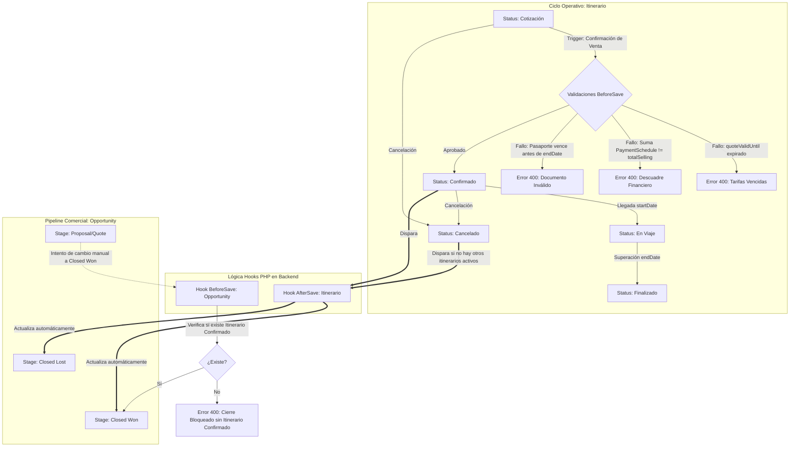

# /docs/plans/travel-data-model.plan.md

## 1. Diseño Estructural de Entidades y Metadatos

Toda la estructura técnica reside en `custom/Espo/Custom/Resources/` para garantizar la inmunidad a actualizaciones del core de EspoCRM.

### A. Entidades Custom y Definiciones de Campos (`entityDefs`)

*   **Itinerario (Tipo Base):**
    *   `name`: varchar(150), requerido.
    *   `status`: enum ('Cotización', 'Confirmado', 'En Viaje', 'Finalizado', 'Cancelado'), audited, default 'Cotización'.
    *   `destination`: varchar(100), requerido.
    *   `startDate`: date, requerido.
    *   `endDate`: date, requerido.
    *   `quoteValidUntil`: datetime (límite de vigencia de tarifas).
    *   `whatsappStatus`: enum ('NotSent', 'Queued', 'Sent', 'Delivered', 'Read', 'Failed'), default 'NotSent'.
    *   `totalCost`: currency (calculado por Hook PHP sumando `BudgetLine.costPrice`).
    *   `totalSelling`: currency (calculado por Hook PHP sumando `BudgetLine.sellingPrice`).
    *   `grossProfit`: currency (calculado por Hook PHP: `totalSelling - totalCost`).
    *   `notes`: text.
    *   *Links:* `opportunity` (belongsTo: Opportunity), `items` (hasMany: ItineraryItem), `budgetLines` (hasMany: BudgetLine), `passengers` (hasMany: Passenger), `paymentSchedules` (hasMany: PaymentSchedule).

*   **ItineraryItem (Tipo Base):**
    *   `name`: varchar(150), requerido.
    *   `serviceType`: enum ('Vuelo', 'Hotel', 'Traslado', 'Tour', 'Seguro', 'Crucero', 'Otro'), audited.
    *   `serviceDate`: datetime, requerido.
    *   `confirmationCode`: varchar(60).
    *   `status`: enum ('Solicitado', 'Confirmado', 'Emitido', 'Cancelado'), default 'Solicitado'.
    *   `notes`: text.
    *   *Links:* `itinerario` (belongsTo: Itinerario), `supplier` (belongsTo: Supplier).

*   **BudgetLine (Tipo Base):**
    *   `name`: varchar(150), requerido.
    *   `costPrice`: currency, requerido.
    *   `marginRate`: float, requerido, default 15.0.
    *   `sellingPrice`: currency, requerido.
    *   `grossProfit`: currency (calculado en frontend y backend: `sellingPrice - costPrice`).
    *   `notes`: text.
    *   *Links:* `itinerario` (belongsTo: Itinerario), `supplier` (belongsTo: Supplier).

*   **Passenger (Tipo Base):**
    *   `name`: varchar(150), requerido.
    *   `documentType`: enum ('Passport', 'DNI', 'IdentityCard', 'Other'), default 'Passport'.
    *   `documentNumber`: varchar(50), requerido.
    *   `documentExpiration`: date.
    *   `birthDate`: date.
    *   `nationality`: varchar(80).
    *   `dietaryRestrictions`: varchar(150).
    *   `notes`: text.
    *   *Links:* `itinerario` (belongsTo: Itinerario), `contact` (belongsTo: Contact).

*   **PaymentSchedule (Tipo Base):**
    *   `name`: varchar(100), requerido.
    *   `dueDate`: date, requerido.
    *   `amount`: currency, requerido.
    *   `status`: enum ('Pendiente', 'Pagado', 'Vencido', 'Cancelado'), default 'Pendiente', audited.
    *   `paymentMethod`: enum ('Transferencia', 'Tarjeta', 'Efectivo', 'LinkDePago', 'Otro').
    *   `transactionId`: varchar(100).
    *   *Links:* `itinerario` (belongsTo: Itinerario).

*   **Supplier (Tipo BasePlus):**
    *   `name`: varchar(150), requerido.
    *   `supplierType`: enum ('Hotel', 'Operador Local', 'Transporte', 'Guía', 'Aerolínea', 'Seguros', 'Mayorista').
    *   `contactEmail`: varchar(100).
    *   `contactPhone`: varchar(30).
    *   `paymentTerms`: text.
    *   *Links:* `itineraryItems` (hasMany: ItineraryItem), `budgetLines` (hasMany: BudgetLine).

*   **PackageTemplate (Tipo Base):**
    *   `name`: varchar(150), requerido.
    *   `destination`: varchar(100), requerido.
    *   `durationDays`: int, default 1.
    *   `basePrice`: currency.
    *   `description`: text.

### B. Extensiones sobre Entidades Nativas
*   **Opportunity:**
    *   Campos: `whatsappChatId` (varchar 100), `lastActivepiecesSync` (datetime).
    *   Links: `cItinerarios` (hasMany: Itinerario, foreign: opportunity).
*   **Contact:**
    *   Links: `passengers` (hasMany: Passenger, foreign: contact).

---

## 2. Diagrama de Flujo de Datos e Integridad Transaccional

---

## 3. Decisiones de Implementación y Trade-offs

### D1: Lógica en Hooks PHP (`Hook/BeforeSave` y `Hook/AfterSave`) vs. Fórmulas JSON
* **Decisión:** Las fórmulas JSON (`formula.json`) se limitan estrictamente al cálculo reactivo local dentro de `BudgetLine` (`sellingPrice = costPrice * (1 + marginRate / 100)` y `grossProfit = sellingPrice - costPrice`). Toda regla relacional, sincronización de entidades cruzadas (Itinerario → Opportunity), agregaciones de sumas financieras y validaciones temporales se implementan en clases PHP Hook bajo `custom/Espo/Custom/Hooks/`.
* **Trade-off:** Requiere escribir y mantener clases PHP en lugar de scripts ligeros en metadata, pero garantiza atomicidad transaccional ACID en MySQL, previniendo condiciones de carrera e inconsistencias generadas por la UI o por inserciones vía API REST.

### D2: Sincronización Unidireccional e Integridad Preventiva
* **Decisión:** El estado del Itinerario gobierna a la Opportunity. Se implementa una guardia estricta en el hook `BeforeSave` de Opportunity que prohíbe el paso a *"Closed Won"* a menos que la oportunidad ya posea un Itinerario en estado *"Confirmado"*.
* **Trade-off:** Agrega una restricción de proceso para los comerciales (no pueden marcar ventas cerradas desde la oportunidad sin haber configurado el itinerario), pero erradica el cierre de negocios ficticios sin costeo operativo.

### D3: Visibilidad del Margen Comercial Bruto para Asesores (Agent)
* **Decisión:** El campo `grossProfit` se incluye en los layouts de lista y detalle de `BudgetLine` e Itinerario para todos los roles (*Agent*, *Manager*, *Admin*), protegiendo `costPrice` y `marginRate` como campos de solo lectura (`readOnly`) una vez confirmado el itinerario.
* **Trade-off:** La agencia asume una política de transparencia interna con su fuerza de ventas respecto a las ganancias brutas a cambio de reducir tiempos de negociación frente al cliente final.

---

## 4. Estrategia de Testing y Verificación

### 1. Unit Tests (PHPUnit)
* **BudgetLineCalculationTest:** Valida que al persistir un registro con `costPrice = 1000` y `marginRate = 20`, los campos calculados resulten `sellingPrice = 1200` y `grossProfit = 200`.
* **PassengerDocumentValidationTest:** Valida que el hook de `Passenger` intercepte y rechace el guardado cuando `documentExpiration <= Itinerario.endDate`.

### 2. Integration Tests (EspoCRM Hook Lifecycle)
* **ItineraryConfirmationGateTest:** Valida que un Itinerario con `quoteValidUntil` en el pasado falle al intentar transicionar a *"Confirmado"*.
* **PaymentBalanceGateTest:** Valida que un Itinerario con `totalSelling = 2500` lance excepción de guardado si los registros asociados de `PaymentSchedule` suman una cifra distinta a `2500` al momento de la confirmación.
* **OpportunityClosedWonGuardTest:** Envía un payload `PUT` a la API REST de EspoCRM intentando pasar una Opportunity a *"Closed Won"* sin itinerarios confirmados asociados, esperando código de respuesta HTTP `400` con el mensaje de error correspondiente.
* **ItineraryToOpportunitySyncTest:** Valida que al persistir exitosamente `Itinerario.status = Confirmado`, la oportunidad relacionada cambie automáticamente a `stage = Closed Won` y `amount = Itinerario.totalSelling`.

### 3. End-to-End (E2E) Scenario
Creación de Lead → Conversión a Contacto y Oportunidad → Creación de Itinerario con 2 servicios (`ItineraryItem`), 2 líneas de costo (`BudgetLine`), 1 pasajero verificado (`Passenger`) y 2 hitos de pago (`PaymentSchedule`) → Confirmación del expediente → Verificación de estados y bloqueo de mutación en costos.

---

## 5. Riesgos Técnicos y Mitigaciones

| Riesgo Técnico | Impacto | Estrategia de Mitigación |
| :--- | :--- | :--- |
| **Condición de carrera por concurrencia externa** (ej. webhook de Respond.io/Activepieces y asesor confirmando en paralelo). | Inconsistencia de saldos o doble transición de estado comercial. | Ejecutar la agregación financiera y el cambio de estado dentro de transacciones de base de datos aisladas (`$entityManager->getTransactionManager()->run(...)`) en MySQL con bloqueo a nivel de fila. |
| **Desfase de Zona Horaria (Timezone Mismatch)** en expiración de tarifas (`quoteValidUntil`). | Bloqueo o aprobación indebida de cotizaciones internacionales. | Almacenar siempre fechas y horas en UTC en base de datos; forzar la conversión explícita contra la zona horaria de la agencia antes de evaluar la expiración. |
| **Ruptura de metadatos por actualización de EspoCRM.** | Incompatibilidad o sobreescritura de layouts custom. | Respetar la jerarquía de directorios `custom/Espo/Custom/` sin alterar archivos bajo `application/Espo/` ni ejecutar alteraciones DDL directas sin pasar por el ORM de EspoCRM. |