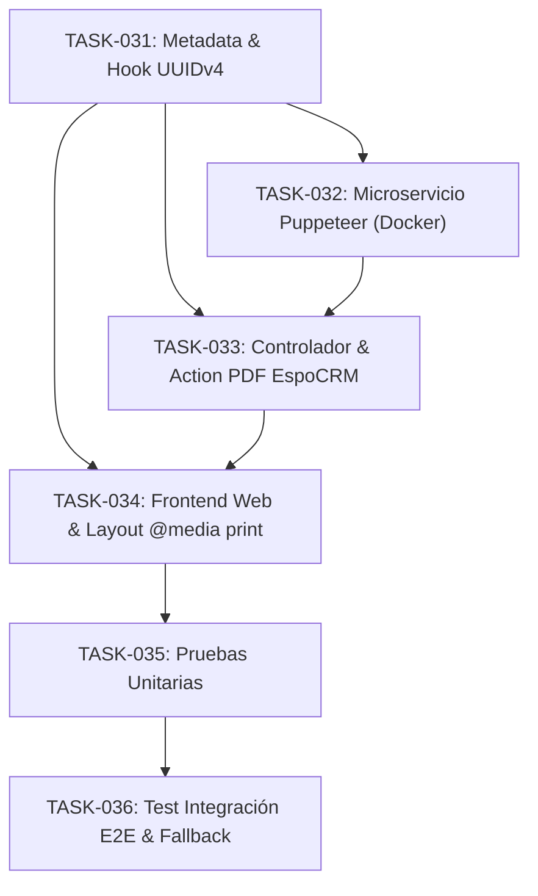

# Tasks 005: Expediente Digital, Vouchers e Itinerarios para Cliente (Puppeteer Headless + Web Responsive)

* **Módulo:** 05 — Expediente Digital, Vouchers e Itinerarios para Cliente
* **Especificación:** `/docs/specs/client-itinerary-expediente.spec.md`
* **Plan Técnico:** `/docs/plans/client-itinerary-expediente.plan.md`
* **Metodología:** Spec-Driven Development (SDD)
* **Regla de Oro:** Todo el código en EspoCRM debe residir strictly bajo `custom/Espo/Custom/` sin alterar el core. El microservicio de renderizado PDF reside en un contenedor Docker desacoplado (`pdf-service`).

---

## 1. Matriz de Dependencias



```text
[TASK-031: Metadata & Hook UUIDv4 en Itinerario]
       │
       ├───► [TASK-032: Microservicio Puppeteer Headless (Docker)]
       │             │
       │             ▼
       ├───► [TASK-033: Controlador & Action de Generación PDF en EspoCRM]
       │             │
       │             ▼
       └───► [TASK-034: Frontend Web Responsive & Layout Imprimible (@media print)]
                     │
                     ▼
       [TASK-035: Suite de Pruebas Unitarias de Token & Aislamiento PDF]
                     │
                     ▼
       [TASK-036: Test de Integración E2E del Expediente y Fallback]
```

---

## 2. Definición Atómica de Tareas

### Épica 1: Esquema de Datos y Tokens Criptográficos en EspoCRM

#### `TASK-031` — Extensión de Metadatos y Hook de Generación de Token UUIDv4
* **Archivos:**
  * `custom/Espo/Custom/Resources/metadata/entityDefs/Itinerario.json`
  * `custom/Espo/Custom/Hooks/Itinerario/GeneratePublicToken.php`
* **Descripción:**
  * En `Itinerario.json`, declarar:
    * `publicAccessToken` (varchar 64, unique: true, index: true, readOnly: true).
    * `webAccessCount` (int, default: 0, readOnly: true).
    * `lastWebAccessAt` (datetime, readOnly: true).
    * `pdfCacheFileId` (varchar 100, readOnly: true).
  * Implementar el hook `GeneratePublicToken.php` en el ciclo `beforeSave`:
    * Verificar si `publicAccessToken` es nulo o vacío.
    * Si no existe, generar un UUIDv4 criptográficamente seguro y asignarlo a la entidad antes de persistir.
* **Criterios de Aceptación (DoD):**
  * `php command.php rebuild` aplica los cambios de esquema en MySQL sin errores.
  * Guardar un nuevo `Itinerario` genera automáticamente un UUIDv4 de 36 caracteres.

---

### Épica 2: Microservicio de Renderizado Headless

#### `TASK-032` — Microservicio Node.js con Puppeteer Core en Docker
* **Archivos:**
  * `docker/pdf-service/Dockerfile`
  * `docker/pdf-service/package.json`
  * `docker/pdf-service/server.js`
  * `docker-compose.yml` (registro del servicio `pdf-service`)
* **Descripción:**
  * Configurar imagen base ligera `node:20-alpine` instalando Chromium y librerías de fuentes del sistema.
  * En `server.js`:
    * Inicializar instancia compartida de Chromium con Puppeteer para evitar sobrecarga de memoria.
    * Exponer endpoint `POST /api/v1/generate` protegido por cabecera de secreto (`PDF_SERVICE_SECRET`).
    * Renderizar la URL recibida emulando `@media print`, formato A4 y márgenes consistentes.
    * Aplicar timeout defensivo de 15 segundos y retornar el stream binario `application/pdf`.
* **Criterios de Aceptación (DoD):**
  * El contenedor `pdf-service` levanta en Docker.
  * Petición curl a `POST /api/v1/generate` con secreto válido genera un binario PDF real mayor a 10 KB.

---

### Épica 3: Backend de Integración y Generación Asíncrona en EspoCRM

#### `TASK-033` — Controlador de Generación PDF y Caché de Documentos
* **Archivos:**
  * `custom/Espo/Custom/Resources/routes.json`
  * `custom/Espo/Custom/Controllers/ItinerarioPdfController.php`
  * `custom/Espo/Custom/Services/ItinerarioPdfService.php`
* **Descripción:**
  * Registrar la ruta `POST /Itinerario/action/generatePdf` con control de autenticación de usuario.
  * Implementar servicio y controlador:
    1. Validar permisos de lectura sobre la entidad `Itinerario`.
    2. Verificar si existe un archivo PDF en caché no modificado (`pdfCacheFileId`); si existe, retornarlo inmediatamente (*Doherty Threshold < 400 ms*).
    3. Si no existe o cambió el itinerario, realizar llamada HTTP interna hacia `http://pdf-service:3000/api/v1/generate`.
    4. Manejar excepciones con Fail-Fast: si el microservicio no responde, capturar la excepción y responder HTTP 503 con mensaje en lenguaje claro sin congelar el backend (*Heurística 9*).
* **Criterios de Aceptación (DoD):**
  * La acción `/Itinerario/action/generatePdf` retorna el buffer binario en menos de 2.5 segundos en la primera invocación y en menos de 200 ms desde caché.

---

### Épica 4: Frontend y Vista Responsive del Expediente

#### `TASK-034` — Maquetación Web Diarizada y Estilos de Impresión (@media print)
* **Archivos:**
  * `docker/travel-web/src/views/ItineraryView.html` (o componente SSR/template)
  * `docker/travel-web/src/public/css/itinerary.css`
* **Descripción:**
  * Construir el expediente público por token (`/p/:token`) de solo lectura:
    * Cabecera con destino, titular, fechas y código PNR.
    * Cronograma diario (*Chunking de Miller*): agrupación visual por días (`Día 01`, `Día 02`).
    * Tarjetas de servicio con iconografía accesible, código de reserva, horarios de recogida destacados y teléfonos de emergencia (*Heurística 6*).
    * Botón de descarga PDF y botón flotante de WhatsApp local.
  * Configurar `@media print`:
    * Ocultar elementos de navegación, botones de acción y chats flotantes.
    * Aplicar `break-inside: avoid` en tarjetas y días para impedir quiebres de página accidentales.
* **Criterios de Aceptación (DoD):**
  * Vista responsive fluida en dispositivos móviles.
  * La vista de impresión (`?print=true`) compila un documento limpio sin saltos de página partidos ni controles de interfaz.

---

### Épica 5: Automatización de Pruebas y Validación E2E

#### `TASK-035` — Suite de Pruebas Unitarias de Token y Renderizador
* **Archivos:**
  * `custom/Espo/Custom/Tests/Unit/ItinerarioTokenHookTest.php`
  * `docker/pdf-service/test/render.test.js`
* **Descripción:**
  * En PHPUnit: validar que `GeneratePublicToken` asigne un UUIDv4 conforme y no sobrescriba tokens existentes.
  * En Node.js/Mocha: validar que `pdf-service` devuelva 401 ante token ausente y 200 con buffer válido ante URL accesible.
* **Criterios de Aceptación (DoD):**
  * Pruebas unitarias ejecutadas en verde al 100%.

#### `TASK-036` — Test de Integración E2E y Resiliencia Offline
* **Archivos:**
  * `tests/integration/ItineraryExpedienteE2ETest.php`
* **Descripción:**
  * Flujo 1: Crear `Itinerario` con 3 días y validar acceso público web mediante token sin exponer márgenes comerciales internos.
  * Flujo 2: Solicitar generación de PDF vía EspoCRM y comprobar integridad del archivo.
  * Flujo 3 (Resiliencia): Detener el contenedor `pdf-service` y verificar que la web del viajero y el CRM sigan respondiendo sin cuelgues ni errores 500 no controlados (*Postel's Law*).
* **Criterios de Aceptación (DoD):**
  * Script E2E confirma generación, caché, privacidad de datos comerciales y tolerancia a fallos.