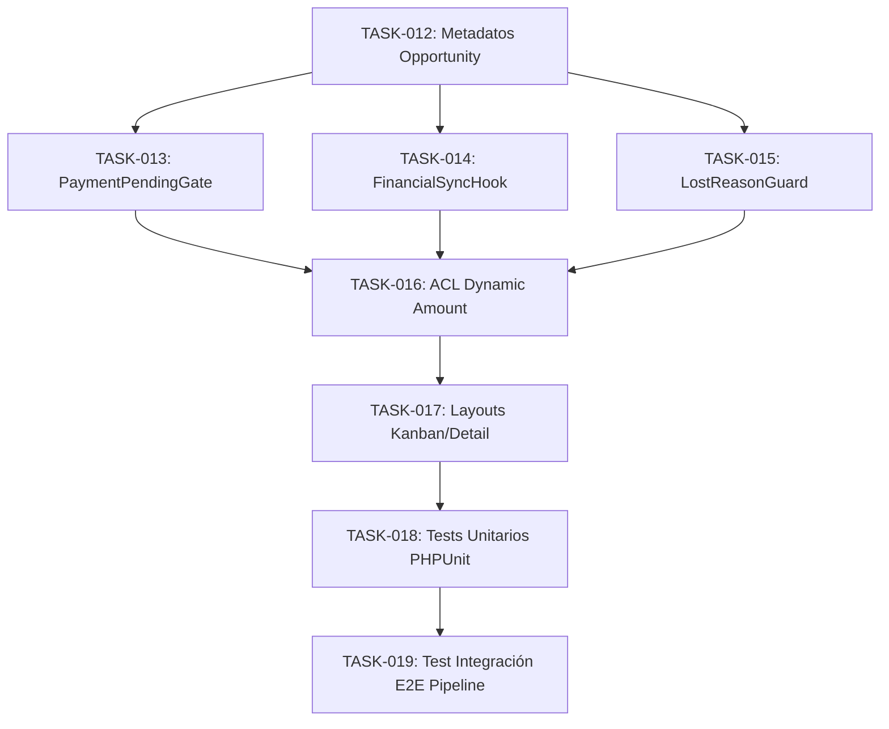

# Tasks 002: Adapted Travel Sales Pipeline Implementation

* **Módulo:** 02 - Pipeline Comercial Adaptado
* **Especificación:** `/docs/specs/travel-sales-pipeline.spec.md`
* **Plan Técnico:** `/docs/plans/travel-sales-pipeline.plan.md`
* **Metodología:** Spec-Driven Development (SDD)
* **Regla de Oro:** Modificaciones exclusivas bajo `custom/Espo/Custom/`. Prohibido alterar el core de EspoCRM.

---

## 1. Matriz de Trazabilidad y Dependencias

### Resumen de Secuencia
1. **TASK-012**: Base de datos y metadatos.
2. **TASK-013**, **TASK-014**, **TASK-015**: Hooks de backend (en paralelo tras TASK-012).
3. **TASK-016**: ACL dinámica (requiere los 3 hooks listos).
4. **TASK-017**: Layouts e interfaz (requiere ACL y metadatos).
5. **TASK-018** & **TASK-019**: Verificación y pruebas automáticas.

---

## 2. Definición Atómica de Tareas

### Épica 1: Estructura de Datos y Metadatos (Opportunity Core)

#### `TASK-012` — Extensión de Metadatos y Etapas Comerciales en Opportunity
* **Archivos:**
  * `custom/Espo/Custom/Resources/metadata/entityDefs/Opportunity.json`
* **Descripción:** 
  * Declarar campos extendidos: `destination` (varchar 100), `travelStartDate` (date), `travelEndDate` (date), `projectedGrossProfit` (currency, readOnly), `leadSource` (enum), `lostReason` (enum) y `lostReasonDetails` (text).
  * Modificar `stage` sustituyendo las opciones por: `Prospecting`, `Qualification`, `Proposal`, `Negotiation`, `PaymentPending`, `Closed Won`, `Closed Lost`.
  * Configurar `probabilityMap` conforme al plan técnico.
* **Criterios de Aceptación (DoD):**
  * `php command.php rebuild` crea/actualiza columnas en MySQL sin errores[cite: 2].
  * En Administration -> Entity Manager -> Opportunity, las etapas y nuevos campos aparecen registrados.

---

### Épica 2: Compuertas Transaccionales y Reglas de Negocio (Backend Hooks)

#### `TASK-013` — Hook de Integridad en Espera de Pago (`PaymentPendingGate`)
* **Archivos:**
  * `custom/Espo/Custom/Hooks/Opportunity/PaymentPendingGate.php`
* **Descripción:**
  * Implementar `beforeSave(Entity $entity, array $options = []): void`[cite: 2].
  * Si `$entity->isAttributeChanged('stage')` y el nuevo estado es `'PaymentPending'`:
    * Consultar si existe al menos un `Itinerario` activo vinculado (`opportunityId == id`) con `status == 'Cotización'`[cite: 2].
    * Si no existe, lanzar `\Espo\Core\Exceptions\BadRequest` con mensaje claro en español[cite: 4]: *"No es posible pasar a Espera de Pago sin un Itinerario en cotización vinculado. Cree o asocie un itinerario primero."*
* **Criterios de Aceptación (DoD):**
  * Mover manualmente o por API una oportunidad sin itinerario a `PaymentPending` retorna HTTP 400.
  * Mover una oportunidad con un itinerario en cotización procede limpiamente.

#### `TASK-014` — Extensión del Hook de Sincronización Financiera (`OpportunitySync`)
* **Archivos:**
  * `custom/Espo/Custom/Hooks/Itinerario/OpportunitySync.php`
* **Descripción:**
  * Extender la lógica del hook existente (creado en TASK-006) en `afterSave`[cite: 2].
  * Cuando se guarde un `Itinerario`:
    * Sincronizar hacia la `Opportunity` asociada los campos: `amount = totalSelling`, `projectedGrossProfit = grossProfit`, `travelStartDate = startDate`, `travelEndDate = endDate`.
    * Si `Opportunity.destination` está vacío, asignar `Itinerario.destination`.
    * Persistir usando `['skipHooks' => true]` para evitar bucles[cite: 2].
* **Criterios de Aceptación (DoD):**
  * Cambios en totales del itinerario recalculan instantáneamente `amount` y `projectedGrossProfit` en la oportunidad vinculada.

#### `TASK-015` — Guardia de Tipificación Obligatoria de Pérdida (`LostReasonGuard`)
* **Archivos:**
  * `custom/Espo/Custom/Hooks/Opportunity/LostReasonGuard.php`
* **Descripción:**
  * Implementar `beforeSave(Entity $entity, array $options = []): void`[cite: 2].
  * Si `$entity->isAttributeChanged('stage')` y el nuevo estado es `'Closed Lost'`:
    * Validar que `$entity->get('lostReason')` no esté vacío.
    * Si está vacío, arrojar `\Espo\Core\Exceptions\BadRequest`[cite: 4]: *"Debe especificar el motivo de pérdida (lostReason) para cerrar la oportunidad como perdida."*
* **Criterios de Aceptación (DoD):**
  * Intento de marcar `Closed Lost` sin motivo retorna HTTP 400. Con motivo válido persiste sin fricción.

---

### Épica 3: Seguridad, Permisos y Experiencia Visual

#### `TASK-016` — Control Dinámico de Edición sobre Monto (ACL de Campo)
* **Archivos:**
  * `custom/Espo/Custom/Acl/Opportunity.php`
  * `custom/Espo/Custom/Resources/metadata/scopes/Opportunity.json`
* **Descripción:**
  * Crear la clase de ACL nativa extendiendo de `\Espo\Core\Acl\Base` (o el trait estándar correspondiente).
  * Implementar `checkReadOnlyField(Entity $entity, string $field, User $user): bool`:
    * Para `$field === 'amount'`: si el usuario no es admin y la oportunidad tiene itinerarios vinculados, devolver `true` (solo lectura). Si no tiene itinerarios, devolver `false` (permite presupuesto manual temprano)[cite: 3].
    * Para `$field === 'projectedGrossProfit'`: devolver siempre `true`.
* **Criterios de Aceptación (DoD):**
  * Asesor puede editar `amount` en oportunidades recién creadas; queda bloqueado tras crear el primer itinerario[cite: 3].

#### `TASK-017` — Layouts Kanban Turístico y Vistas Estructuradas (Chunking)
* **Archivos:**
  * `custom/Espo/Custom/Resources/layouts/Opportunity/kanban.json`
  * `custom/Espo/Custom/Resources/layouts/Opportunity/detail.json`
* **Descripción:**
  * Configurar `kanban.json` para agrupar visualmente destino, rango de fechas, monto de venta y margen bruto proyectado[cite: 3].
  * Adaptar `detail.json` en paneles temáticos limpios: Datos Comerciales, Finanzas/Márgenes y Cierre/Descarte[cite: 3, 4].
* **Criterios de Aceptación (DoD):**
  * El tablero Kanban muestra las tarjetas de viaje con métricas de rentabilidad legibles sin abrir el modal[cite: 3, 4].

---

### Épica 4: Automatización de Pruebas y Validación E2E

#### `TASK-018` — Suite de Pruebas Unitarias (Compuertas de Pipeline)
* **Archivos:**
  * `custom/Espo/Custom/Tests/Unit/OpportunityPipelineGatesTest.php`
* **Descripción:**
  * Probar `PaymentPendingGate` ante casos válidos (con itinerario en cotización) e inválidos (sin itinerario).
  * Probar `LostReasonGuard` verificando que exija el motivo en descarte[cite: 4].
* **Criterios de Aceptación (DoD):**
  * Suite PHPUnit ejecutada en verde (`0 failures, 0 errors`).

#### `TASK-019` — Test de Integración E2E del Pipeline Comercial
* **Archivos:**
  * `custom/Espo/Custom/Tests/Integration/OpportunityPipelineE2ETest.php`
* **Descripción:**
  * Recorrer el ciclo completo:
    1. Crear Oportunidad con monto estimado manual.
    2. Intentar mover a `PaymentPending` (comprobar bloqueo 400)[cite: 4].
    3. Crear `Itinerario` en Cotización y comprobar sincronización automática de `amount` y bloqueo de edición manual[cite: 2, 3].
    4. Mover a `PaymentPending` con éxito.
    5. Confirmar Itinerario y comprobar transición automática a `Closed Won` (validando TASK-006 / TASK-007 previas).
    6. Probar descarte a `Closed Lost` con y sin motivo[cite: 4].
* **Criterios de Aceptación (DoD):**
  * Ejecución CLI en verde validando la interacción entre Oportunidad e Itinerario[cite: 2].