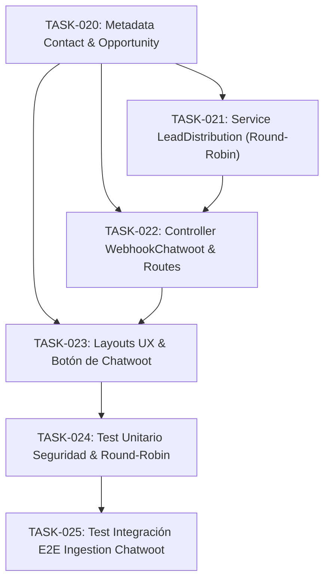

# Tasks 003: WhatsApp Integration Implementation (Chatwoot + Meta Cloud API)

* **Módulo:** 03 — Integración WhatsApp & Omnicanalidad
* **Especificación:** `/docs/specs/whatsapp-integration.spec.md`
* **Plan Técnico:** `/docs/plans/whatsapp-integration.plan.md`
* **Metodología:** Spec-Driven Development (SDD)
* **Regla de Oro:** Todas las adiciones deben implementarse exclusivamente bajo `custom/Espo/Custom/`. El core de EspoCRM permanece intacto.

---

## 1. Matriz de Dependencias

---

## 2. Definición Atómica de Tareas

### Épica 1: Esquema de Datos y Metadatos

#### `TASK-020` — Extensión de Metadatos en Contact, Opportunity y Configuración
* **Archivos:**
  * `custom/Espo/Custom/Resources/metadata/entityDefs/Contact.json`
  * `custom/Espo/Custom/Resources/metadata/entityDefs/Opportunity.json`
  * `data/config.php`
* **Descripción:**
  * En `Contact.json`: declarar `chatwootContactId` (varchar 100, index: true, readOnly), `chatwootConversationId` (varchar 100, readOnly) y `lastWhatsappMessageAt` (datetime, readOnly).
  * En `Opportunity.json`: declarar `chatwootConversationId` (varchar 100, index: true, readOnly) y `whatsappChannel` (varchar 50, default: "Línea Oficial WhatsApp").
  * En `data/config.php`: inicializar `chatwootWebhookSecret`, `chatwootBaseUrl`, `chatwootAccountId` y `roundRobinLastAgentId`.
* **Criterios de Aceptación (DoD):**
  * `php command.php rebuild` crea las columnas en MySQL sin errores.
  * Los campos figuran en el Entity Manager y el esquema relacional queda listo.

---

### Épica 2: Lógica de Negocio y Distribución de Leads

#### `TASK-021` — Servicio de Distribución Rotativa (`LeadDistributionService`)
* **Archivos:**
  * `custom/Espo/Custom/Services/LeadDistributionService.php`
* **Descripción:**
  * Implementar el algoritmo de asignación Round-Robin consultando usuarios activos con rol `Agent` ordenados por ID.
  * Manejar fallback defensivo hacia el primer usuario `Admin` si no existen agentes activos.
  * Persistir atómicamente en la configuración el ID del último asesor asignado (`roundRobinLastAgentId`).
* **Criterios de Aceptación (DoD):**
  * Invocar el servicio retorna de forma cíclica los IDs de los agentes activos y actualiza el puntero de configuración.

#### `TASK-022` — Controlador de Webhook de Entrada y Rutas API
* **Archivos:**
  * `custom/Espo/Custom/Resources/routes.json`
  * `custom/Espo/Custom/Controllers/WebhookChatwoot.php`
* **Descripción:**
  * Registrar la ruta `POST /webhook/chatwoot` con `auth: false` en `routes.json`.
  * En el controlador `WebhookChatwoot.php`:
    1. Validar la cabecera `Authorization: Bearer <TOKEN>` contra `chatwootWebhookSecret` mediante `hash_equals()`. Si falla, arrojar `Unauthorized` (HTTP 401).
    2. Filtrar evento para procesar únicamente mensajes entrantes de clientes o creación de conversaciones.
    3. Normalizar el teléfono al estándar internacional E.164 (`+51...`) tolerando nombres vacíos (asigna `"Viajero WhatsApp"`).
    4. Resolver `Contact`: buscar por teléfono; si no existe, crearlo; si existe, actualizar IDs y timestamp.
    5. Resolver `Opportunity`: si tiene una abierta, vincular `chatwootConversationId`; si no, solicitar agente a `LeadDistributionService` y crear una nueva en `Prospecting`.
* **Criterios de Aceptación (DoD):**
  * Petición HTTP sin token devuelve 401.
  * Petición válida con payload de Chatwoot crea o vincula Contacto y Oportunidad devolviendo HTTP 200.

---

### Épica 3: Interfaz y Experiencia de Usuario (UX)

#### `TASK-023` — Layout de Detalle con Enlace Rápido a Chatwoot y Acción de Escalado
* **Archivos:**
  * `custom/Espo/Custom/Resources/layouts/Opportunity/detail.json`
* **Descripción:**
  * Incluir en el panel *"Información Comercial del Viaje"* el campo `chatwootConversationId`.
  * Configurar enlace de acción directa para abrir la conversación en Chatwoot (`{chatwootBaseUrl}/app/accounts/{accountId}/conversations/{id}`) en pestaña nueva (Ley de Fitts).
  * Habilitar la acción de reasignación rápida hacia la guardia/admin (Heurística 3: Control y Libertad).
* **Criterios de Aceptación (DoD):**
  * La vista de detalle de la oportunidad muestra el identificador de chat y el acceso directo navegable.

---

### Épica 4: Automatización de Pruebas y Validación

#### `TASK-024` — Suite de Pruebas Unitarias de Seguridad y Asignación
* **Archivos:**
  * `custom/Espo/Custom/Tests/Unit/ChatwootWebhookSecurityTest.php`
* **Descripción:**
  * Validar el rechazo (HTTP 401) ante tokens ausentes o inválidos.
  * Validar la rotación del servicio `LeadDistributionService` mediante mocks de usuarios.
* **Criterios de Aceptación (DoD):**
  * Suite PHPUnit ejecutada en verde (`0 failures, 0 errors`).

#### `TASK-025` — Test de Integración E2E del Flujo de Ingesta
* **Archivos:**
  * `custom/Espo/Custom/Tests/Integration/ChatwootIngestionE2ETest.php`
* **Descripción:**
  * Enviar payload sintético simulando nuevo chat de WhatsApp. Verificar creación de `Contact` y `Opportunity` en etapa `Prospecting` con agente asignado.
  * Enviar segundo payload con el mismo remitente. Comprobar que no duplica el `Contact` y actualiza la oportunidad activa.
* **Criterios de Aceptación (DoD):**
  * Ejecución por CLI confirmando las aserciones de base de datos e integridad relacional.

